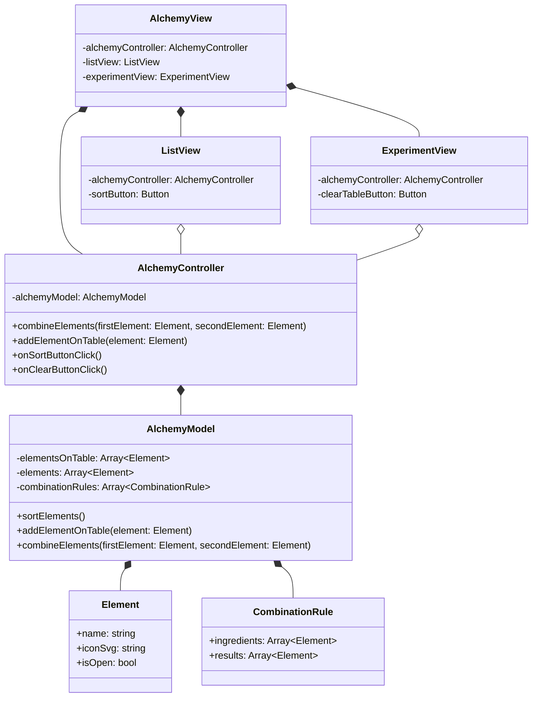

```mermaid
classDiagram
    class AlchemyView {
        -alchemyController: AlchemyController
        -listView: ListView
        -experimentView: ExperimentView
    }
    class ListView {
        -alchemyController: AlchemyController
        -sortButton: Button
    }
    class ExperimentView {
        -alchemyController: AlchemyController
        -clearTableButton: Button
    }
    
    class AlchemyModel {
        -elementsOnTable: Array~Element~
        -elements: Array~Element~
        -combinationRules: Array~CombinationRule~
        
        +sortElements()
        +addElementOnTable(element: Element)
        +combineElements(firstElement: Element, secondElement: Element)
    }
    
    class AlchemyController {
        -alchemyModel: AlchemyModel
        
        +combineElements(firstElement: Element, secondElement: Element)
        +addElementOnTable(element: Element)
        +onSortButtonClick()
        +onClearButtonClick()
    }
    
    class Element {
        +name: string
        +iconSvg: string
        +isOpen: bool
    }

    class CombinationRule {
        +ingredients: Array~Element~
        +results: Array~Element~
    }
    
    AlchemyView *-- AlchemyController
    AlchemyView *-- ListView
    AlchemyView *-- ExperimentView
    AlchemyController *-- AlchemyModel

    ListView o-- AlchemyController
    ExperimentView o-- AlchemyController
    
    AlchemyModel *-- Element
    AlchemyModel *-- CombinationRule
```